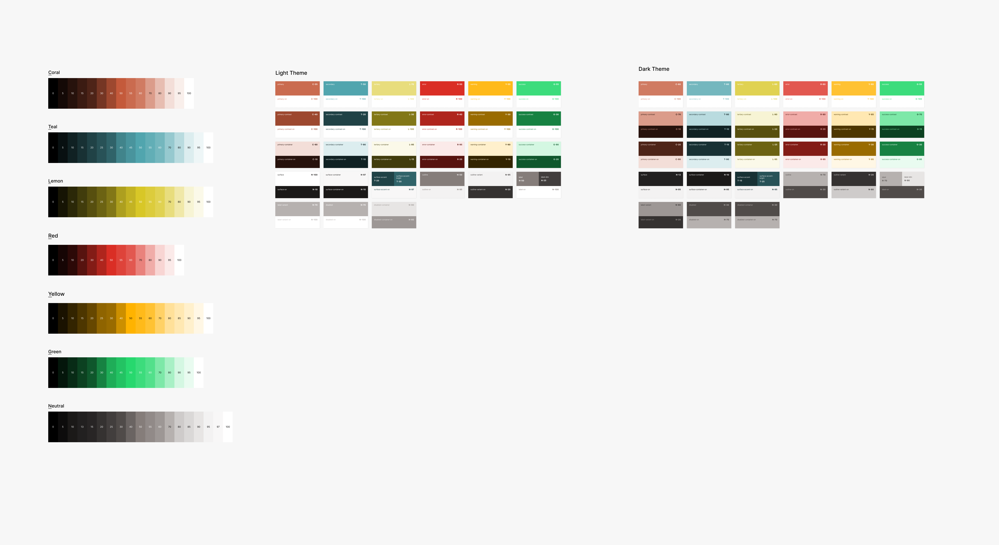
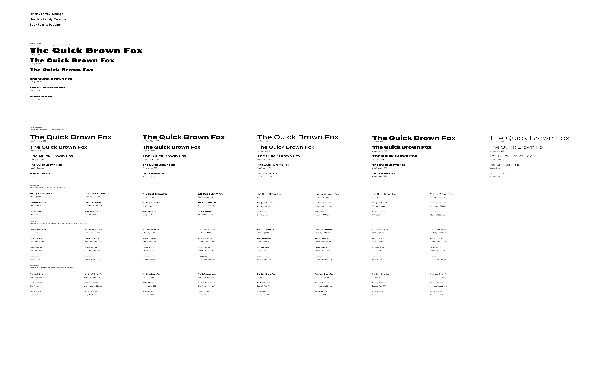

# Design System and Style Guide

This design system was based on the system developed by [Material Design 3](https://m3.material.io/)

Other systems can be viewed here: <https://open-ui.org/design-systems/>

## Table of Contents

- [Table of Contents](#table-of-contents)
- [TL;DR](#tldr)
  - [Color Summary](#color-summary)
  - [Typography Summary](#typography-summary)
- [Tokens](#tokens)
  - [Global elements](#global-elements)
  - [Local/scoped elements](#localscoped-elements)
- [Colors](#colors)
  - [Syntax](#syntax)
  - [Colors \& Color Roles](#colors--color-roles)
    - [Color names](#color-names)
    - [Color Roles](#color-roles)
  - [Light and Dark Mode](#light-and-dark-mode)
- [Typography](#typography)
  - [Display](#display)
  - [Headline](#headline)
  - [Title](#title)
  - [Label](#label)
  - [Body](#body)
- [Figma Definitions](#figma-definitions)

## TL;DR

### Color Summary

To use colors that change with light/dark mode:

```css
.example-component {
  background-color: var(--color-primary-container);
  color: var(--color-primary-container-on);
}
```

Main color tokens: `primary`, `secondary`, `tertiary`, `error`, `warning`, `success`.

Common modifiers: `contrast`, `container`, `accent`, `dim`, `bright`

### Typography Summary

Use the predefined typography using SCSS mixins:

```scss
.example-component {
  // Uses the default weight
  @include font-body('md');
}

.example-component-bold {
  // Uses a custom weight of 600
  @include font-title('md', 600);
}
```

Font groups: `display`, `headline`, `title`, `label`, `body`

## Tokens

### Global elements

Will be named using this structure:

```txt
[element|token]-[category|role]-[property|modifier]--[variant]--[state]
```

Example:

```scss
// Naming css variables
.example {
  color: var(--color-surface-on--light);
}
```

- Token: `color`
- Role: `surface`
- Modifier: `on` (signifies the color of text that appears on `color-surface` in this case)
- Variant: `light` (used for light mode only)

```html
<!-- Naming html classes -->
<div class="form-group--large">...</div>
```

- Element: `form`
- Category: `group`
- Variant: `large`

### Local/scoped elements

Uses the following structure:

```txt
[element]__[nested-element]--[variant]
```

Nesting can go as far down as necessary.

Example:

```html
<nav class="nav-bar">
  
  <ul class="nav-bar__list">
    <li class="nav-bar__list__item"></li>
    <li class="nav-bar__list__item"></li>
    <li class="nav-bar__list__item"></li>
  </ul>
  <ul class="nav-bar__list--mobile">
    ...
  </ul>
</nav>
```

When nesting, elements can be children of their nearest parent, or of a further parent up the tree. This is up to the descretion of the developer. Example:

```html
<!-- 
The image and list are shown as a child of nav-bar, despite being nested inside the group containers. The reasoning is because these elements don't necessarily identify with the group, but with the nav as a whole.
   
However, the divider element is shown as a child of group because it might not be useful or relevant except as an element inside of a group.
-->
<nav class="nav-bar">
  <div class="nav-bar__group">
    
  </div>
  <div class="nav-bar__group">
    <hr class="nav-bar__group__divider" />
    <ul class="nav-bar__list">
      <li class="nav-bar__list__item"></li>
      <li class="nav-bar__list__item"></li>
      <li class="nav-bar__list__item"></li>
    </ul>
  </div>
</nav>
```

Scoping html classes in this way allows for the following SCSS code:

```scss
.nav-bar {
  // full class: nav-bar
  // ...

  &__image {
    // full class: nav-bar__image
    // ...
  }

  &__list {
    // full class: nav-bar__list
    // ...

    &__item {
      // full class: nav-bar__list__item
      // ...
    }

    &--mobile {
      // full class: nav-bar__list--mobile
      // ...
    }
  }
}
```

## Colors

Token: `color`

### Syntax

Naming structure:

```txt
color-[role]-[modifier]--[variant]
```

Example:

```scss
.component {
  background-color: var(--color-surface);
  color: var(--color-surface-on);
}
```

### Colors & Color Roles

#### Color names

Main colors:

- Coral
- Teal
- Lemon

System Colors:

- Red
- Yellow
- Green
- Neutral

#### Color Roles

> Color Role: where color is used in UI

Every color roles has an associated "on" color, or the color that text should be if it were to appear on that color.

Main roles:

- **Primary**: The main brand color
- **Secondary**: Main accent color used to compliment primary
- **Tertiary**: Sparsely used accent color
- **Error**: Indicates wrong, bad, negative state
- **Warning**: Indicates a state of caution
- **Success**: Indicates a good state, successful action, proper path
- **Surface**: Main area text goes on

Utility roles:

- **Outline**: Used for border colors
- **Label**: Lighter version of a text ("on") color used as an accent, aside, eyebrow, or similar
- **Disabled**: This, when paried with an appropriate "on" color, should notate something is unusable. This is usually achieved by giving little contrast between the color and it's "on" color, and/or making either color slightly transparent

Role Modifiers (allow roles to be more flexible):

- **Container**: A color’s variation of surface
- **Dim**: Variation of the color that's a bit darker
- **Bright**: Variant of the color that's a bit lighter
- **Variant**: An alternate hue of the color meant to complement it
- **Inverse**: Variation of the color on the opposite side of the lightness spectrum
- **Disabled**: If element is unusable, may also have some alpha
- **Alpha#**: Transparent version of the color, with # being a number representing alpha level 0-100
- **On**: Contrast color, used for text/icons. This should at least pass acessibility AA tests, but not essential for some colors
- **Contrast**: When paired with "on" colors, they should pass the AA/AAA accessibility tests and should be used when text needs to be readable. To learn more about contrast and accessibility:
  - [BOIA.org](https://www.boia.org/blog/designing-for-color-contrast-guidelines-for-accessibility)
  - [WebAIM.org](https://webaim.org/articles/contrast/)

Role Variants (can be used to replace a color given a certain state change):

- **Light**: Version of the color used in light mode
- **Dark**: Version of the color used in dark mode

### Light and Dark Mode

Theme mode is currently handled in pure css (made easier using SCSS), and determined based on css variables for the theme colors. How? Like this:

```css
/* 
All colors are defined at the root level, these will not change after the app is initialized, even when changed between light and dark mode. 
*/
:root {
  /* 
  Tonal Color Definitions
  These are based on the color names established earlier,
  and represent a gradient of lightness values for each color.
  */
  --tonal-n-0: rgb(0, 0, 0);
  --tonal-n-5: rgb(13, 13, 13);
  --tonal-n-10: rgb(26, 26, 26);
  --tonal-n-13: rgb(36, 33, 31);
  /* ... etc ... */
  --tonal-n-95: rgb(242, 242, 242);
  --tonal-n-97: rgb(247, 247, 247);
  --tonal-n-100: rgb(255, 255, 255);

  /* Theme Color Roles */
  --color-surface--light: var(--tonal-n-100);
  --color-surface-on--light: var(--tonal-n-10);
  --color-surface--dark: var(--tonal-n-13);
  --color-surface-on--dark: var(--tonal-n-95);
}

html[data-theme-mode='light'] .theme {
  /*
  When the html tag has the theme attribute set to light mode, set the base theme color to its light variant.
  */
  --color-surface: var(--color-surface--light);
  --color-surface-on: var(--color-surface-on--light);
}

html[data-theme-mode='dark'] .theme {
  /*
  When the html tag has the theme attribute set to dark mode, set the base theme color to its dark variant.
  */
  --color-surface: var(--color-surface--dark);
  --color-surface-on: var(--color-surface-on--dark);
}
```

All of this code is generated automatically based on a config map set in `src/styles/theme/_colors.scss` and `src/styles/theme/_tonal.scss`. This makes is really easy to change any given color, or color role. The code to generate all of this css can be found in `src/styles/_stylesheet.scss`.

Since the actual light and dark mode colors are determined by css, the only place where js is needed is to switch out the `data-theme-mode` attribute on the html tag. There is a small js singleton in `src/utils/ui/themeManager.ts` whose purpose is to manage the value of this attribute, and stored theme mode in local storage to allow the theme mode to stay after refreshing the page. Having a singleton stops race conditions between reading/writing the html tag attribute and reading/writing the value stored in local storage.

To use light and dark mode, simply use the root theme color:

```css
.example-component {
  background-color: var(--color-primary-container);
  color: var(--color-primary-container-on);
}
```

Alternatively, if you want to set the background color and text color together (like the above example), you can use a scss mixin:

```scss
.example-component {
  // Sets color and background-color
  @include color-role('primary-container');
}
```

## Typography

Token: `font`

To use the default weight:

```scss
.example-class {
  // Using the default weight:
  @include font-[role]('[size]');

  // Using a custom weight:
  @include font-[role]('[size]', [weight]);
}
```

### Display

Used as standalone large text marking a larger section or domain.

Available sizes: `xl`, `lg`, `md`, `sm`, `xs`

Available weights: `400`

Use:

```scss
.example-class {
  // Default weight: 400
  @include font-display('md');
}
```

### Headline

Marks normal sections and text blocks, classic headers 1-2.

Available sizes: `lg`, `md`, `sm`

Available weights: `300`, `500`, `600`, `700`, `900`

Use:

```scss
.example-class {
  // Default weight: 600
  @include font-headline('md');

  // Custom weight
  @include font-headline('md', 300);
}
```

### Title

Precludes lower emphasis sections, classic headers 3-6.

Available sizes: `lg`, `md`, `sm`

Available weights: `300`, `400`, `600`, `700`

Use:

```scss
.example-class {
  // Default weight: 600
  @include font-title('md');

  // Custom weight
  @include font-title('md', 700);
}
```

### Label

Utility text, represents actions or small-form items.
Should never head sections, content, etc.

Available sizes: `lg`, `md`, `sm`, `xs`

Available weights: `300`, `400`, `500`, `600`

Use:

```scss
.example-class {
  // Default weight: 500
  @include font-label('md');

  // Custom weight
  @include font-label('md', 300);
}
```

### Body

Long form text, normal base text, provides easiest reading experience.

Available sizes: `lg`, `md`, `sm`

Available weights: `300`, `400`, `500`, `600`

Use:

```scss
.example-class {
  // Default weight: 600
  @include font-body('md');

  // Custom weight
  @include font-body('md', 700);
}
```

## Figma Definitions

These are the Figma definitions of everything as of 1/1/25.

_Color System_


_Typography System_

